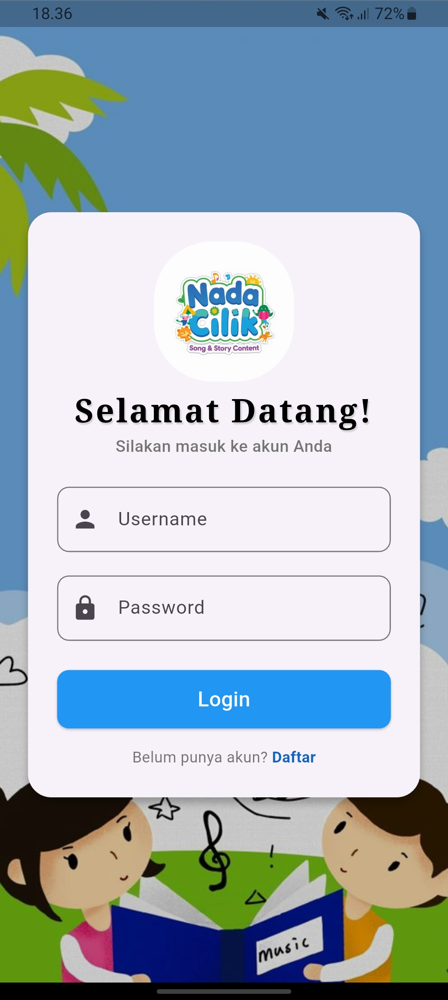
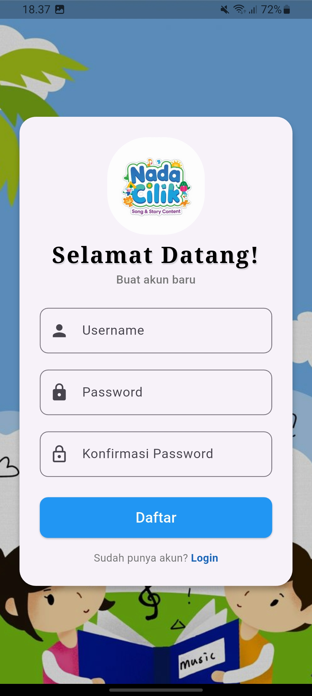
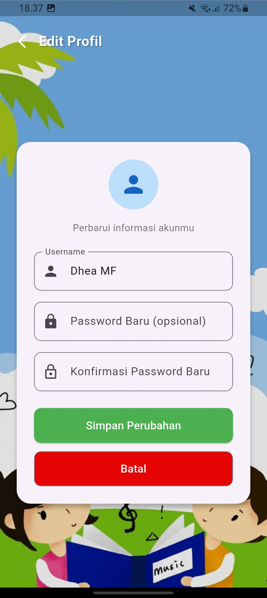
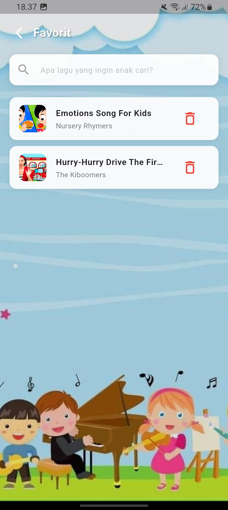
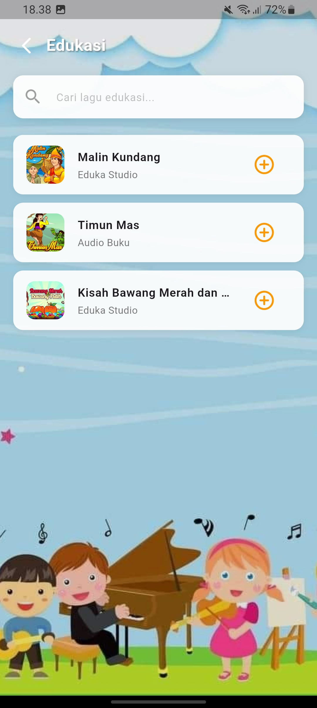
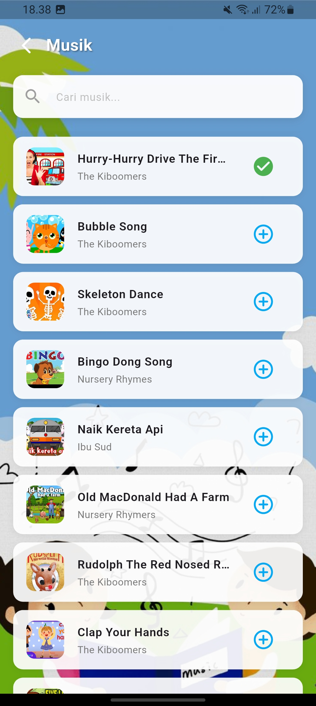
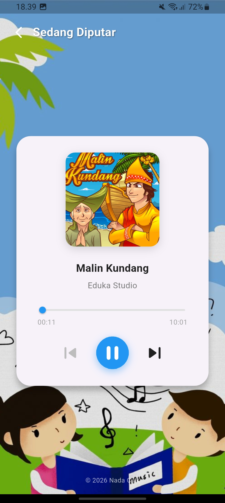
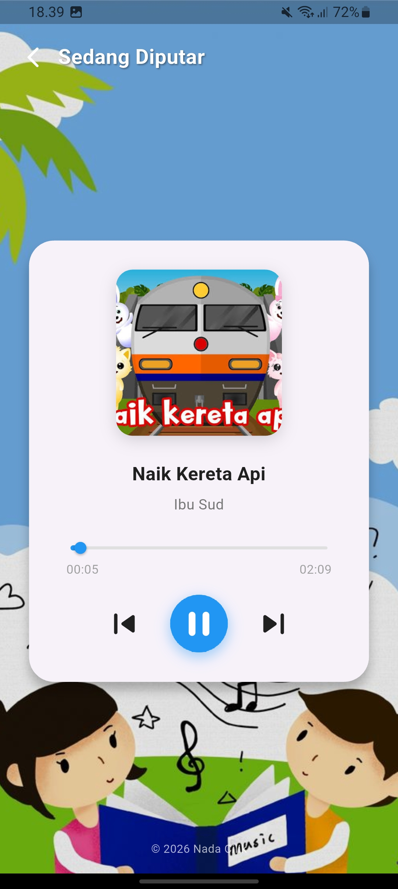
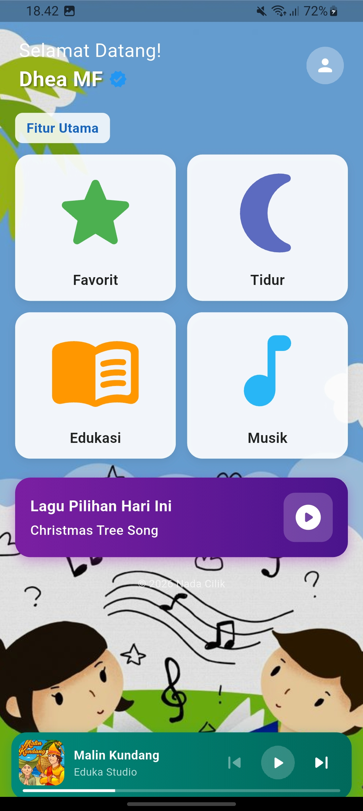

# Nada Cilik

Aplikasi pembelajaran musik untuk anak-anak, dibangun menggunakan Flutter dan Firebase. Nada Cilik menyediakan koleksi lagu musik dan edukasi yang dapat diputar langsung, dilengkapi fitur favorit, pengaturan waktu tidur otomatis, dan player audio dengan mini player yang persisten di seluruh halaman.

## 

## Tentang Aplikasi

Nada Cilik dirancang untuk membantu anak-anak belajar sambil mendengarkan musik dengan antarmuka yang ramah anak — penuh warna, ikon besar, dan navigasi yang sederhana.

## 

## Fitur Utama

* **Login \& Register** — sistem autentikasi sederhana dengan validasi input
* **Edit Profil** — ubah username dan password
* **Musik** — koleksi lagu musik anak dengan pencarian
* **Edukasi** — koleksi lagu edukasi anak dengan pencarian
* **Favorit** — simpan dan kelola lagu favorit
* **Player Audio** — streaming audio dengan kontrol play/pause/next/previous dan auto-next
* **Mini Player** — pemutar mini yang tetap muncul di semua halaman saat lagu sedang diputar
* **Pengaturan Tidur (Sleep Timer)** — atur waktu otomatis musik berhenti, dengan notifikasi peringatan
* **Lagu Pilihan Hari Ini** — banner rekomendasi lagu di halaman utama
* **Deteksi Koneksi Internet** — notifikasi saat aplikasi tidak terhubung ke internet

## 

## Teknologi yang Digunakan

|Teknologi|Kegunaan|
|-|-|
|[Flutter](https://flutter.dev)|Framework utama pengembangan aplikasi|
|[Firebase Firestore](https://firebase.google.com/products/firestore)|Database untuk data pengguna, lagu, dan favorit|
|[just\_audio](https://pub.dev/packages/just_audio)|Pemutaran audio streaming|
|[cached\_network\_image](https://pub.dev/packages/cached_network_image)|Caching gambar dari URL|
|[shared\_preferences](https://pub.dev/packages/shared_preferences)|Penyimpanan status login lokal|

## 

## Struktur Proyek

```
lib/
├── pages/
│   ├── login\\\_page.dart          # Halaman login \\\& register
│   ├── home\\\_page.dart           # Halaman utama dengan grid fitur
│   ├── musik\\\_page.dart          # Daftar lagu musik
│   ├── edukasi\\\_page.dart        # Daftar lagu edukasi
│   ├── favorit\\\_page.dart        # Daftar lagu favorit
│   ├── sleep\\\_page.dart          # Pengaturan waktu tidur
│   ├── player\\\_page.dart         # Pemutar audio utama
│   ├── editprofil\\\_page.dart     # Edit profil pengguna
│   ├── mini\\\_player\\\_widget.dart  # Widget mini player global
│   ├── audio\\\_manager.dart       # Singleton pengelola audio
│   ├── sleep\\\_manager.dart       # Singleton pengelola sleep timer
│   ├── connectivity\\\_helper.dart # Pengecekan koneksi internet
│   └── snackbar\\\_helper.dart     # Notifikasi custom
├── firebase\\\_options.dart
└── main.dart
```

## Cara Menjalankan Proyek

### Prasyarat

* Flutter SDK 3.11 atau lebih baru (cek dengan `flutter --version`)
* Akun Firebase dengan project aktif
* Editor (VS Code direkomendasikan)

### 

### Langkah-langkah

1. Clone repository ini

```bash
   git clone https://github.com/USERNAME-ANDA/nada-cilik.git
   cd nada-cilik
   ```

2. Install dependencies

```bash
   flutter pub get
   ```

3. Hubungkan ke Firebase (jika belum terhubung)

```bash
   dart pub global activate flutterfire\\\_cli
   flutterfire configure
   ```

4. Jalankan aplikasi

```bash
   flutter run -d chrome
   ```

atau untuk Android:

```bash
   flutter run
   ```

### Build APK

```bash
flutter clean
flutter pub get
flutter build apk --release
```

File APK akan tersedia di `build/app/outputs/flutter-apk/app-release.apk` — file inilah yang dibagikan ke dosen/penguji untuk diinstal langsung di perangkat Android tanpa perlu menjalankan source code.

## 

## Struktur Database (Firestore)

|Collection|Keterangan|
|-|-|
|`users`|Data login pengguna (username, password)|
|`lagu`|Katalog lagu (judul, artis, audio\_url, cover\_url, tipe, featured)|
|`favorit`|Lagu yang disimpan pengguna sebagai favorit|

## 

## Pengujian (Testing)

Aplikasi telah diuji pada lingkungan berikut:

|Platform|Perangkat|Status|
|-|-|-|
|Web|Chrome (localhost:3000)|✅ Berjalan normal|
|Android Emulator|Pixel API 34|✅ Berjalan normal|
|Android Fisik|*(isi merk/tipe HP yang dipakai uji coba)*|✅ Berjalan normal|

**Alur pengujian yang dilakukan:**

* Register akun baru → Login → masuk Home
* Navigasi ke seluruh fitur: Musik, Edukasi, Favorit, Sleep Timer
* Tambah \& hapus lagu dari Favorit
* Putar lagu, pindah halaman, pastikan mini player tetap berjalan
* Aktifkan Sleep Timer dan pastikan aplikasi tertutup otomatis saat waktu habis
* Edit profil dan logout
* Uji kondisi tanpa koneksi internet (notifikasi muncul dengan benar)

## 

## Kendala \& Solusi

Berikut beberapa kendala utama yang ditemukan selama pengembangan beserta solusinya:

|Kendala|Penyebab|Solusi|
|-|-|-|
|Audio berhenti saat berpindah halaman|`AudioPlayer` di-dispose setiap halaman ditutup|Buat `AudioManager` sebagai singleton agar audio tetap berjalan di background|
|Sleep timer reset saat keluar dari halaman Tidur|Timer disimpan di state widget yang ikut ter-dispose|Pindahkan logic timer ke `SleepManager` singleton, independen dari lifecycle halaman|
|Tombol *next/previous* di mini player tidak berfungsi|Mini player tidak tahu playlist \& index lagu yang aktif|Tambahkan `currentPlaylist`, `currentIndex`, dan stream `laguChangedStream` di `AudioManager`|
|Notifikasi (SnackBar) tetap muncul setelah pindah halaman|`ScaffoldMessenger` bawaan Flutter tidak otomatis hilang saat navigasi|Buat `snackbar\\\_helper.dart` dengan notifikasi custom yang konsisten di semua halaman|
|Tombol terlihat bergaris meski sudah diberi warna|Salah memakai `OutlinedButton` alih-alih `ElevatedButton`|Ganti seluruh tombol solid menjadi `ElevatedButton`|
|Dialog konfirmasi tampilannya polos|Memakai `AlertDialog` bawaan tanpa kustomisasi|Buat dialog custom dengan ikon bulat, rounded corner, dan warna senada aplikasi|

## 

## Screenshot

|Login|Registrasi|Edit Profil|
|-|-|-|
||||

|Favorit|Pengaturan Tidur|Edukasi|
|-|-|-|
||||

|Musik|Player Edukasi|Player Musik|
|-|-|-|
||||

|Beranda|
|-|
||

## 

## Pengembang

Dikembangkan sebagai proyek tugas akhir mata kuliah Pemrograman Mobile.

## 

## Lisensi

Proyek ini dibuat untuk keperluan akademik.

\---

© 2026 Nada Cilik. Dibuat dengan Flutter \& Firebase.

